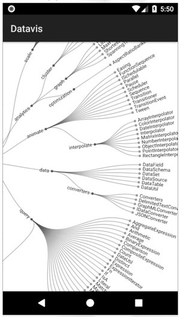

# Android-Data-Visualization
This project is covered in the book:

https://www.apress.com/us/book/9781484239506
# About the Project
Intro.

# More
Project Name: Android Data Visualization

Source: **android_data_vis.zip** or **github.com/wickapps/Android-Data-Visualization** 

Type: Android Application

# File Summary

| File | Description
| :--- | :---
| app->src->main->AndroidManifest.xml | Configuration file
| app->src->main->res->layout->activity_main.xml | Layout file for display of the WebView.
| app->src->main->assets->d3.min.js | Local copy of the d3 Javascript library
| app->src->main->assets->flare.csv | Local copy of the CSV datafile
| app->src->main->assets->radial-dendo-csv.html | Local copy of the HTML code for radial dendogram visualization
| app->src->main->java->MainActivity.java | Main Java source to load and display the D3 visualization.

# Android App Screenshot

